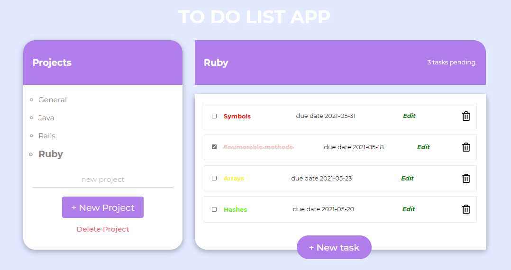

# TODO LIST

> TODO LIST is a web application build with JavaScript, CSS and HTML. It stores the data locally in the browser with help of the inbuilt JavaScript localStorage API. This application helps a user organize his/her Todo tasks into projects with specific deadlines for each project. A user can specify the urgency of the application so it can be given priority. 

## TODO LIST Snapshot.


## Built With

- Javascript,
- HTML,
- CSS

## Live Demo

[Live Demo Link](https://gango-anan.github.io/to-do-list/)


## Getting Started

To get a local copy up and running follow these simple example steps.

### Clone the repo: 
```
$ git clone https://github.com/gango-anan/to-do-list.git

```

## Setup and run the application
### Install node.js:
```
First install node.js
```
### Next, navigate to the project folder and install the dependencies using the following command:
```
$ npm install
```
## Run test
```
$ npm test
If all the tests pass, you are good to go.
```
## Lauch Application 
```
Run the application by launching your local webserver and lauching the index.html file in the browser
http://127.0.0.1:5500/dist/index.html

```

## Author
- Galiwango Ananiya
- Github: [@gango_anan](https://github.com/gango-anan) 
- Twitter: [@gango_anan](https://twitter.com/gango_anan)
- LinkedIn: [@galiwango-ananiya](https://www.linkedin.com/in/galiwango-ananiya/) 

## 🤝 Contributing

Contributions, issues and feature requests are welcome! Start by:

Feel free to check the [issues page](https://github.com/gango-anan/to-do-list/issues).

## Show your support

Give a ⭐️ if you like this project!

## Acknowledgments
- FreeCodeCamp
- Credit goes to TheOdinProject.

## 📝 License

This project is [MIT](https://github.com/gango-anan/to-do-list/blob/development/LICENSE) licensed.
